<h1 align="center">
   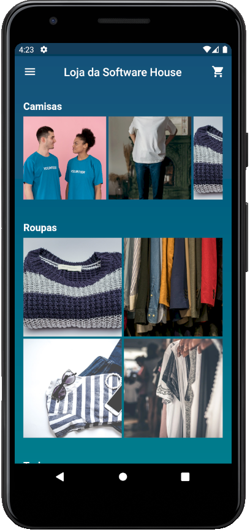
</h1>

<h4 align="center"> 
	🚧 Loja da Software House 🚀 Concluido...  🚧
</h4>

## ✅ Funções

- <h3>Gerenciamento de Usuários:</h3>
  
  - [x] Login
  - [x] Login com facebook
  - [x] Cadastro
  - [x] Listar usuários
  - [x] Pesquisar usuários
  - [x] Recuperar Senha

- <h3>Home</h3>
  
  - [x] Menu
  - [x] Menu: Edição
  - [x] Home: Edição

- <h3>Produtos</h3>
  
  - [x] Lista de produtos
  - [x] Detalhes do produto
  - [x] Formulário de produto

- <h3>Pedidos</h3>
  
  - [x] Meus pedidos
  - [x] Lojas
  - [x] Lista de Pedidos gerais

## 📚 Descrição
  
  - Há algum tempo, embarquei em um desafio de desenvolvimento ao criar um aplicativo inovador utilizando o framework Flutter. Este aplicativo para uma loja virtual foi cuidadosamente projetado e implementado para oferecer aos usuários uma experiência intuitiva e eficiente. Integrei com sucesso um sistema de pagamento por cartão, permitindo transações seguras e rápidas. Além disso, implementei a autenticação por meio do Facebook, simplificando o processo de login para os usuários. O aplicativo também incluiu recursos robustos de gerenciamento, permitindo aos administradores controlar facilmente produtos, lojas e usuários. Durante esse projeto, aprimorei minhas habilidades em Flutter, gerenciamento de estado, integração de API e design de interfaces amigáveis, aprendendo valiosas lições sobre eficiência no desenvolvimento de aplicativos móveis e a importância da usabilidade para o sucesso do produto.

## 🛠 Tecnologias

As seguintes ferramentas foram usadas na construção do projeto:

-  [Flutter](https://flutter.dev/?gclid=Cj0KCQjwkbuKBhDRARIsAALysV4sMSKWcOxrlBmdtlCcf3MAfNdH1ehbbWi6ZjjjdypPLsSvdTFiqOYaAon3EALw_wcB&gclsrc=aw.ds)
-  [Dart](https://dart.dev/)

## 📱 Plataforma adotada

  - Android;
  - iOS;

## 📸 Screenshot

	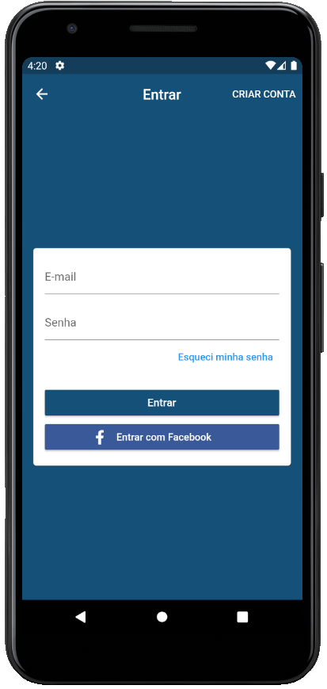
	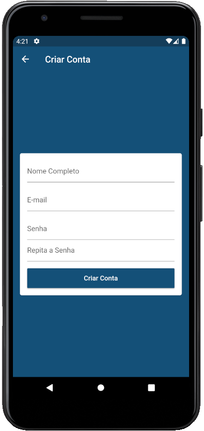
	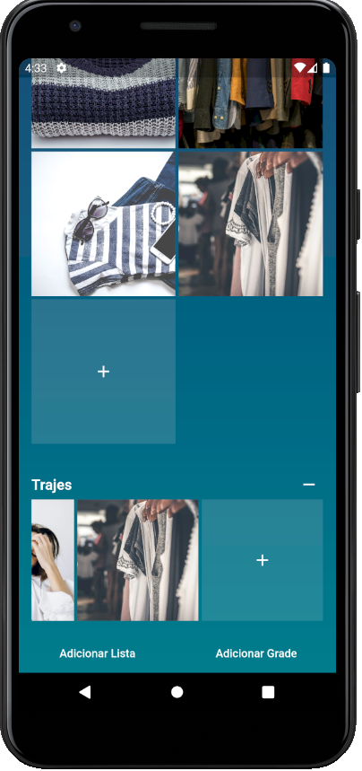

	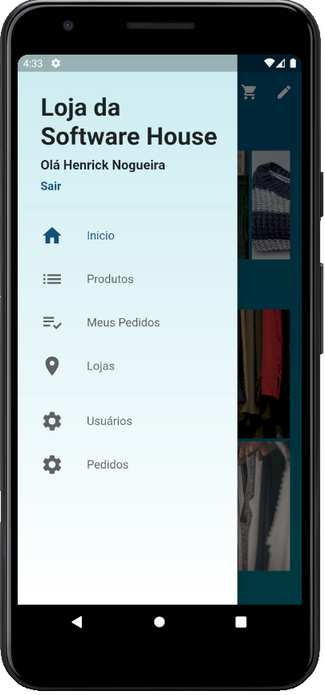
	
	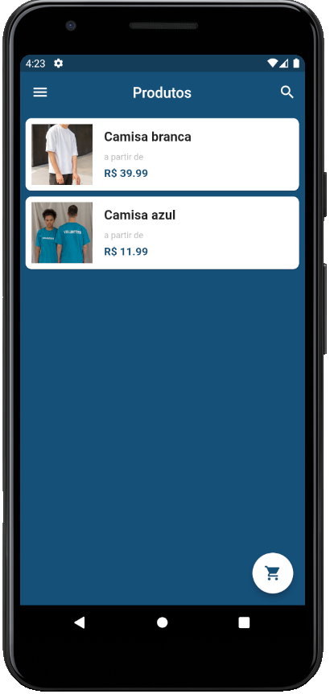

	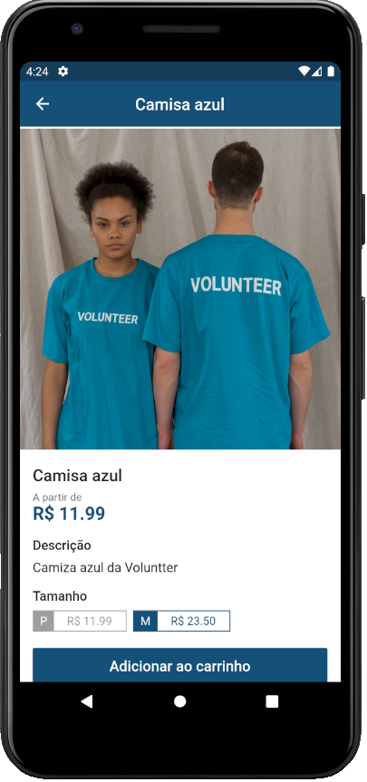
	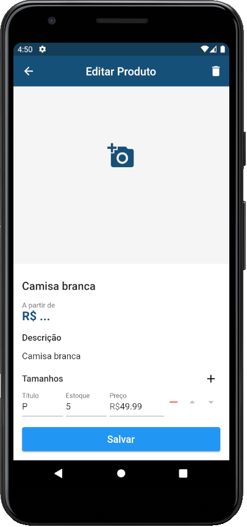
	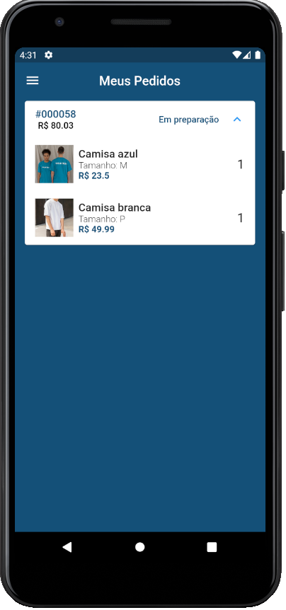

	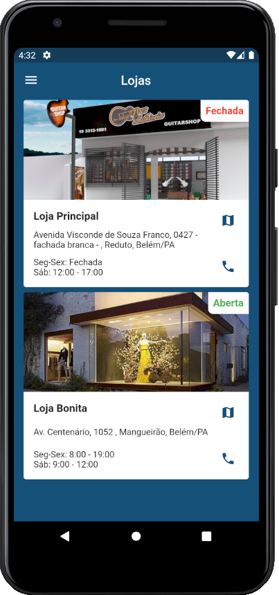
	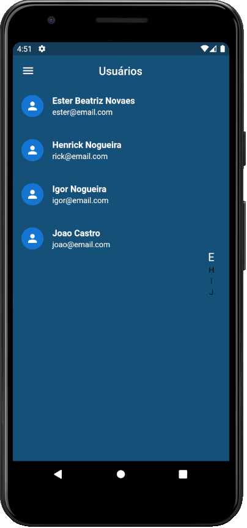
	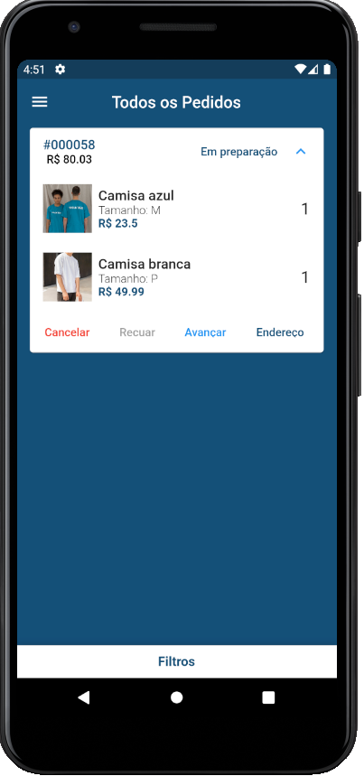

	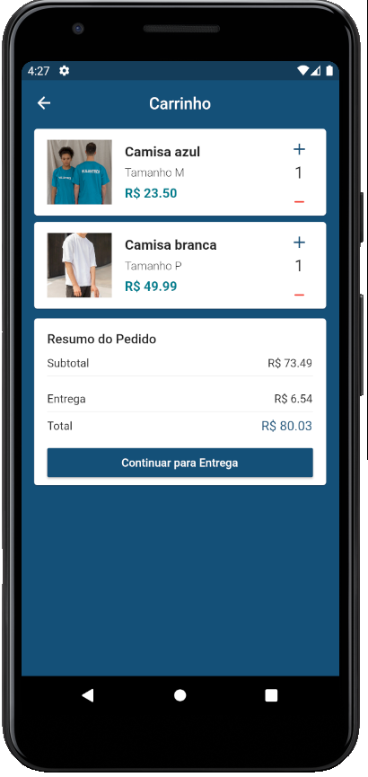
	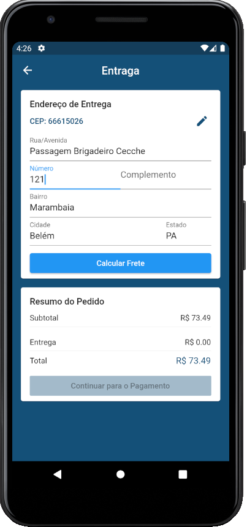
	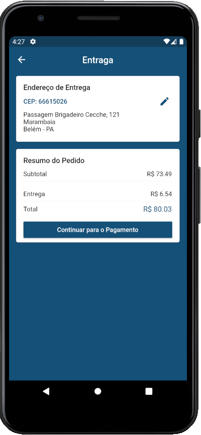

	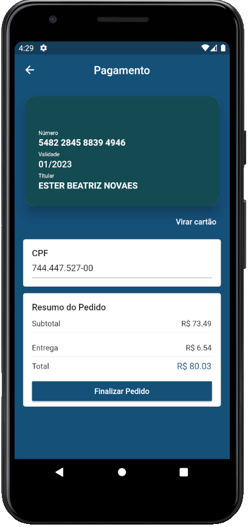
	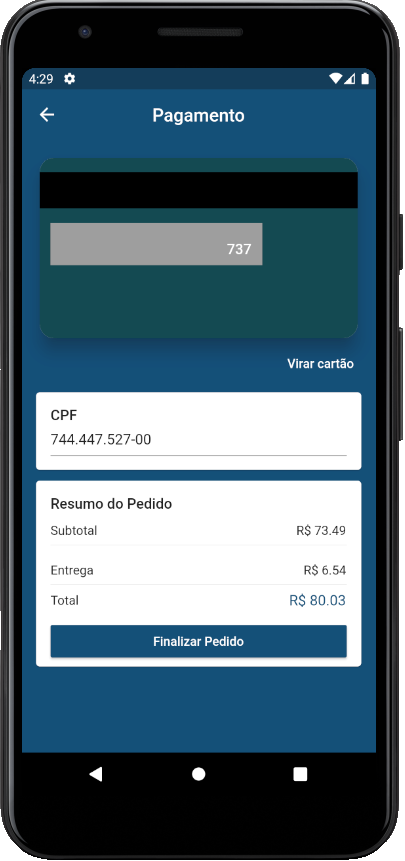
	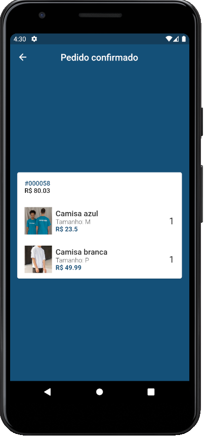

